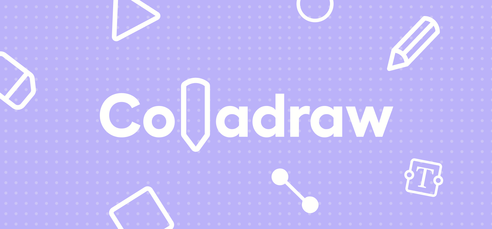

<p align="center">
  
</p>

### <p align="center"> Colladraw • <a href="https://colladraw.fun" > colladraw.fun </a> </p>

## Installation

 0. `NPM`, `PHP`, `composer` et `mysql` sont requis
 1. Installer les modules `NPM`:
    ```sh
    npm i
    ```
 2. Installer les modules `composer`:
    ```sh
    composer i
    ```
 3. Créer un fichier `.env`:
    ```sh
    cp .env.example .env
    nano .env
    ```
 4. Migrer la base de données:
    ```sh
    php artisan migrate:fresh
    ```
    _Pensez à créer la base de données comme spécifiée dans votre fichier `.env`._
 5. Générer les clés:
    ```sh
    php artisan key:generate
    ```
 6. Pour démarrer l'environnement de développement:
    ```sh
    npm run dev
    ```

## Explications

### 1. Pourquoi 
Dans le cadre d'un projet dans notre [école](https://www.hetic.net/), nous avons eu pour exercice de refaire l'application "Paint" en une semaine et en groupe de 4.

### 2. Contraintes imposées
- Dessiner un rectangle, un triangle (pointe vers le haut) et un cercle
- Dessiner une zone de texte
- Possibilité d'utiliser une couleur "primaire" pour le contour des formes ou pour la couleur du texte
- Possibilité d'utiliser une couleur "secondaire" pour le remplissage des formes ou le surlignement du texte
- Un menu déroulant permettant de sélectionner une police d'écriture parmis trois
- Déplacer la forme
- Modifier les dimensions de la forme
- Changer les couleurs de la forme
- Sauvegarder le dessin pour le reprendre plus tard
- Exporter le dessin au format image et au format PDF 

### 3. Objectifs supplémentaires du groupe
- Possibilité de créer un compte et de se connecter
- Un espace "Profil" pour stocker les dessins et les reprendre ultérieurement
- Inviter des personnes via un lien et ainsi dessiner à plusieurs
- Si plusieurs personnes dessinent sur le même projet, stocker le dessin sur tous les profils
- Mettre le site sur un serveur
- Possibilité de créer un trait
- Possibilité d'effacer avec une gomme
- Possibilité de dessiner avec un crayon
- Retour arrière et retour avant
- WebSocket pour tout stocker en temps réel

### 4. Répartition des tâches 
- [Amaury FRANSSEN](https://github.com/ExploryKod) (Front)
- [Anthony RINGRESSI](https://github.com/Anthony-Rgs) (Front & Design)
- [Arthur FONTAINE](https://github.com/arthur-fontaine) (Full Stack)
- [Baptiste DAUPHOUY](https://github.com/baptistedph) (Full Stack)


## Technologies utilisées

### 1. Front


### 2. Back


### 3. Design


## Canvas

Pour ce projet il nous était interdit d'utiliser des librairies. 
Afin de simplifier notre code et de le rendre plus clair nous avons développé notre propre bibliothèque en TypeScript
disponible sur ce <a href="https://github.com/arthur-fontaine/auto-colladraw">repo GitHub</a> et sur
<a href="https://www.npmjs.com/package/colladraw">NPM</a>.


## Nos inspirations

- Excalidraw
- GarticPhone
- Paint
